# StoryGuard

**An evidence-first manuscript analysis application and AI engineering portfolio project.**

StoryGuard turns uploaded manuscripts into searchable passages and a source-linked Story Bible of entities, facts, events, and relationships. It combines hybrid retrieval, pretrained specialist models, structured LLM outputs, background processing, and measured model comparisons.

**[Read the architecture guide](docs/architecture/README.md)** · **[Prepare for interviews](docs/architecture/interview-guide.md)** · **[Explore models and routing](docs/architecture/models-and-gateway.md)**



## What works today

| Capability | Implementation |
| --- | --- |
| Manuscript ingestion | TXT, Markdown, and DOCX; versioned original files; chapter/scene parsing; overlapping chunks; progress and cancellation |
| Search | Elasticsearch BM25 + EmbeddingGemma vectors, Python RRF fusion, and selectable BGE cross-encoder reranking |
| Named entities | Gemma extraction by default; selectable GLiNER2.5 Base or Qwen3.5 9B; source spans and type validation |
| Entity resolution | xCoRe exact-span shortcuts, Gemini deployment pool with local Gemma fallback, audited merge decisions, review, Stop/Resume |
| Story memory | Evidence-linked facts, events, relationships, narrative/chronological Timeline, and partial-coverage reporting |
| Experiment Lab | Fixed development retrieval comparisons, fingerprinted artifacts, metrics, and failure inspection |
| Observability | Optional LangSmith traces with configurable content privacy |

Grounded Story QA, bounded planning, and character-attribute continuity review are upcoming. Some frontend screens anticipate those capabilities; their presence does not mean a working backend exists. The authoritative [course progress](COURSE_PROGRESS.md) currently points to **7.1: Grounded Story QA — not started**.

## How it is built

- **Application:** Next.js / React / TypeScript / Tailwind → FastAPI / Pydantic.
- **State and processing:** PostgreSQL / SQLAlchemy / Alembic, MinIO, Taskiq + RabbitMQ.
- **Retrieval:** Elasticsearch 8.19, Sentence Transformers, EmbeddingGemma, BGE reranker.
- **AI:** pretrained GLiNER and xCoRe, Ollama-hosted Gemma/Qwen, LiteLLM-routed Gemini, LangSmith traces.
- **Runtime:** local Docker Compose; Ollama runs on the host.

The model gateway handles generative calls. Embeddings, reranking, GLiNER, and xCoRe run directly in API/worker runtimes. PostgreSQL owns domain state; Elasticsearch is a derived index. No custom-trained model or fine-tuned adapter is currently deployed.

## Documentation

| Start here | Go deeper |
| --- | --- |
| [System overview and capability status](docs/architecture/system-overview.md) | [Application, API, and storage](docs/architecture/application-and-storage.md) |
| [Manuscript ingestion](docs/architecture/manuscript-ingestion.md) | [Embeddings, search, and reranking](docs/architecture/embeddings-and-search.md) |
| [Entity extraction and resolution](docs/architecture/entity-extraction-and-resolution.md) | [Facts, events, and relationships](docs/architecture/structured-story-memory.md) |
| [Model inventory and LiteLLM load balancing](docs/architecture/models-and-gateway.md) | [Evaluation, measured trade-offs, and tracing](docs/architecture/evaluation-and-observability.md) |
| [Interview walkthrough and answers](docs/architecture/interview-guide.md) | [Glossary and reading paths](docs/architecture/README.md) |

The guide includes editable Mermaid diagrams and shareable SVG images. It distinguishes active behavior from historical experiments and future designs.

## Run locally

Prerequisites: Docker with Compose, host Ollama reachable from containers at `host.docker.internal:11434`, and `gemma4:e4b` available in Ollama for default extraction, structured memory, and resolution fallback. Pull a Qwen model only if you select that extractor. The Compose setup is oriented to Docker Desktop; other hosts may require host-network configuration.

Create the local environment file without overwriting an existing one:

```sh
test -f .env || cp .env.example .env
```

Set `HF_TOKEN` after accepting EmbeddingGemma's Hugging Face access terms. Set `GEMINI_API_KEY` for the promoted resolution API pool. Keep credentials in the ignored `.env` file. LangSmith is optional and disabled by default. Model downloads need network access and local disk/RAM; first use can take considerably longer than warm inference.

From the repository root:

```sh
docker compose config --quiet
docker compose up -d --build backend worker frontend
```

Compose starts the storage, queue, search, and LiteLLM dependencies. The backend applies Alembic migrations on startup. Open the [application](http://localhost:3000) and [backend API documentation](http://localhost:8000/docs).

Create a project, upload a short manuscript, and wait until processing completes. Search and the chapter reader then use the current ready version. Resolve entities from Story Bible, then explicitly build story memory to populate facts/events/relationships. Search starts with reranking enabled; uncheck it for the hybrid-only path.

The Experiment Lab additionally needs the local retrieval fixtures; follow the existing [dataset guide](docs/DATASETS.md) and [bootstrap script](backend/scripts/bootstrap_datasets.py). Downloaded datasets, model caches, and detailed experiment artifacts are not all included in a fresh clone.

These instructions were checked against Compose, Dockerfiles, environment names, and route/configuration code. A clean image build and live model workflow were **not rerun for this documentation update**. See [documentation verification](docs/architecture/verification.md).

## Engineering evidence

- Hybrid retrieval improved held-out Recall@10 from **0.8734 to 0.9056** versus BM25. [Experiment](docs/experiments/2026-08-25-hybrid-rrf.md)
- Reranking improved MRR@10 from **0.7126 to 0.8544** across 233 test queries, with substantial local latency cost. [Results and trade-off](docs/learning/cross-encoder-reranking.md)
- Two Gemini deployments passed the fixed pool-admission comparison; another API model was rejected for frequent provider failures. [Promotion report](docs/experiments/2026-09-13-flash-lite-pool-promotion.md)

These are historical, scoped measurements, not production guarantees. The [evaluation guide](docs/architecture/evaluation-and-observability.md) also covers known regressions, small-sample limitations, and the difference between valid evidence references and correct interpretation.

## Learning course and project scope

StoryGuard is also a dialogue-first AI engineering course. Use `$storyguard-course-lesson` to continue from [COURSE_PROGRESS.md](COURSE_PROGRESS.md). [COURSE.md](COURSE.md) defines the remaining lessons; [USER_COMMANDS.md](USER_COMMANDS.md) and [CODEX_WORKFLOW.md](CODEX_WORKFLOW.md) explain the workflow.

[Learning notes](docs/learning/README.md), [experiment reports](docs/experiments/README.md), and [design specifications](docs/specs/storyguard_backend_ai_spec.md) serve different purposes: completed understanding, historical evidence, and intended design. The [architecture guide](docs/architecture/README.md) describes the current implementation.

This is a personal, non-commercial local project with no production deployment or planned sale. Model and dataset attribution, provenance, and license terms remain applicable. Cloud deployment is outside the current course. The requested post-core LoRA experiment is isolated future work, not an active product dependency.
