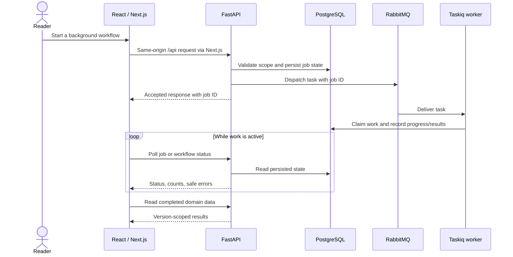
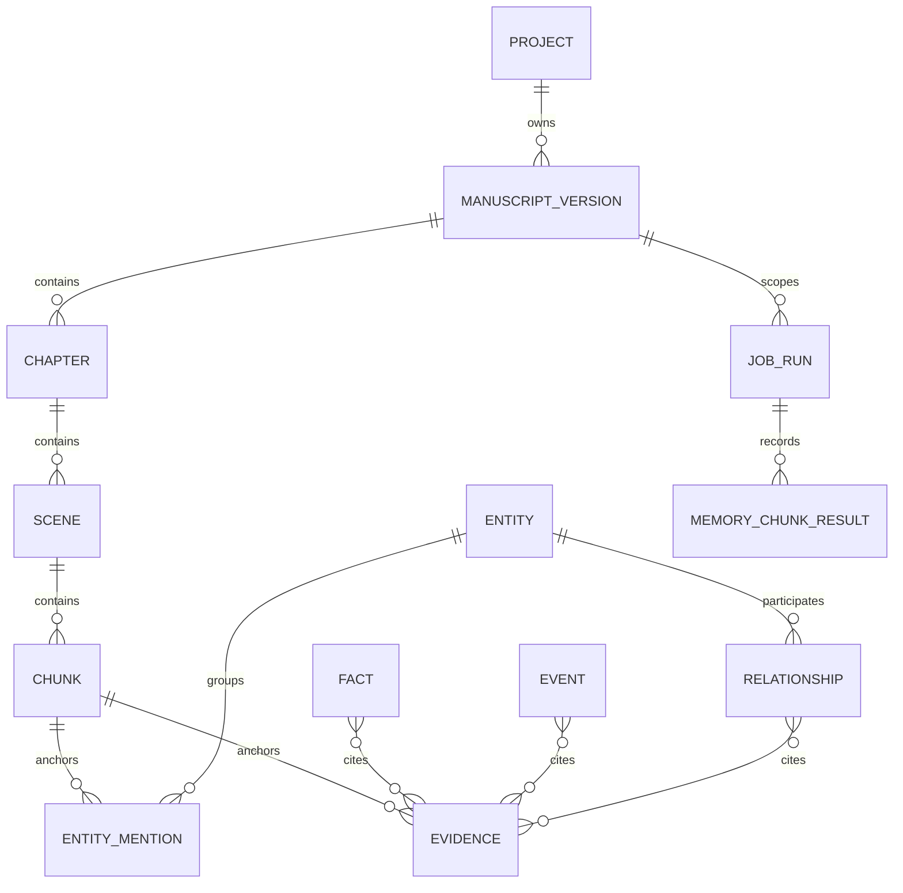

# Application and storage

[Guide index](README.md) · Previous: [Overview](system-overview.md) · Next: [Ingestion](manuscript-ingestion.md)

## Purpose

Keep HTTP interactions responsive while long-running manuscript work executes in workers. Store durable application state separately from binary source files and derived retrieval data.

## Request and job flow

This is the common shape; each workflow owns its own dispatch and failure guards. RabbitMQ messages trigger work. They are not the authoritative progress record.

The browser calls relative `/api` URLs. Next.js rewrites them to `API_PROXY_TARGET`, which is `http://backend:8000` in Compose. The browser does not receive Docker service names or provider credentials. TanStack Query stores UI query state; that cache is not a substitute for database persistence. Ingestion, resolution, experiments, and memory use polling. The frontend SSE parser is reserved for the future chat endpoint.

## Data ownership

| Store | Contents | Recovery/consistency implication |
| --- | --- | --- |
| PostgreSQL | Projects, versions, chapters/scenes/chunks, jobs, mentions, entities, decisions, memory, evidence, experiment summaries | Source of truth for current version and committed domain results |
| MinIO | Original uploaded bytes under project/version keys | Preserves the source even though parsing normalizes text |
| Elasticsearch | Chunk text, scope IDs, content hash, embedding version, 768-dimensional vectors | Derived index; can be rebuilt from source/parsed data and pinned models |
| RabbitMQ | Task deliveries | A delivery can repeat; workers must inspect durable state |
| Ignored `.local/` | Model caches and detailed experiment artifacts | Useful local reproducibility data, not guaranteed to exist in a GitHub clone |
| LangSmith | Optional external execution traces | Diagnostic copy; PostgreSQL remains authoritative if export fails |

This is a conceptual subset of the schema. Citation associations and relationship endpoints have their own columns/tables; not every foreign key is drawn. The project also stores a pointer to its current manuscript version.

## API contracts to know

Below, `{p}`, `{v}`, and `{j}` mean project, manuscript-version, and job UUIDs. OpenAPI at `/docs` on the backend contains the full contracts.

| Request | Behavior |
| --- | --- |
| `GET/POST /api/projects`; `GET/PATCH/DELETE /api/projects/{p}` | Project CRUD |
| `GET /api/extraction-models` | Server-owned upload model choices |
| `POST /api/projects/{p}/manuscripts` | Multipart `file` and optional `extraction_model`; returns version/job IDs and status |
| `GET /api/jobs/{j}` | Status, stage, counts, elapsed time, and safe error fields |
| `POST /api/projects/{p}/manuscripts/{v}/cancel` | Cancel processing of an eligible version |
| `GET /api/projects/{p}/search?q=...&rerank=false` | Up to ten current-version passages; no generated answer |
| `POST /api/projects/{p}/entity-resolution/run` | Start/resume resolution pinned to a manuscript version |
| `GET /api/projects/{p}/entities?type=character` | Read resolved Story Bible entities |
| `POST /api/projects/{p}/structured-memory/run` | JSON `manuscript_version_id` and optional `rebuild`; returns a job |
| `GET /api/projects/{p}/facts`, `/events`, `/relationships` | Read usable structured memory for the current scope |

## Worked example

Uploading the teaching manuscript returns a version and job reference, not extracted relationships. Polling shows ingestion stages. After completion, the project points to the ready version. Separate resolution and memory requests then produce the Story Bible and Timeline data. Reading `/events` during a failed rebuild can still return a prior usable run for the same scope.

## Implementation links

[Browser API client](../../frontend/lib/api.ts) · [Next.js proxy](../../frontend/next.config.mjs) · [API registrations](../../backend/app/main.py) · [database models](../../backend/app/db/models) · [migrations](../../backend/migrations) · [broker and retry middleware](../../backend/app/queue/broker.py) · [job/upload contracts](../../backend/app/schemas/ingestion.py)

## Choices and failure behavior

An out-of-process worker avoids tying a long inference job to an open browser request. Durable job records make refresh and Resume possible. The broker's general retry middleware permits three total invocations for selected transient exceptions; resolution and structured memory disable automatic task retries and implement their own lifecycle rules.

PostgreSQL, MinIO, RabbitMQ, and Elasticsearch do not share one transaction. Upload uses best-effort object cleanup on database failure; ingestion gates current-version promotion on successful completion. This is bounded application coordination, not an exactly-once distributed transaction or an implemented outbox.

Project/version scope is enforced by workflow queries, but there is no user authentication layer. In particular, the job read endpoint looks up a job by ID; do not describe it as an authenticated tenant-scoped API. Database project deletion is not a documented garbage collector for MinIO objects or Elasticsearch documents.

`/health/live` means the API process responds. `/health/ready` checks PostgreSQL, MinIO, and Elasticsearch; it does not prove that RabbitMQ, models, LiteLLM, or every workflow is ready.
