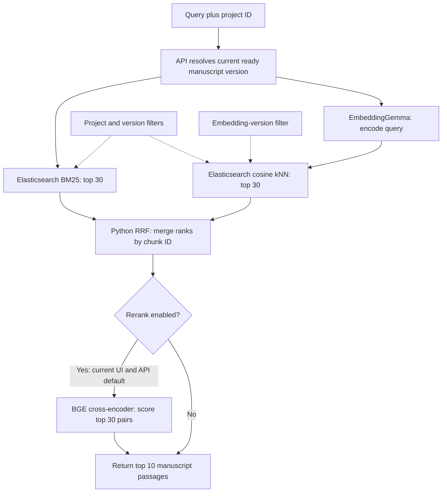

# Embeddings and search

[Guide index](README.md) · Previous: [Ingestion](manuscript-ingestion.md) · Next: [Entities](entity-extraction-and-resolution.md)

## Purpose

Find manuscript passages using both exact words and semantic similarity. The current endpoint returns ranked text with source identifiers. It does not yet synthesize an answer, run a planner, rewrite queries, or use HyDE.

## Retrieval architecture

[Shareable SVG](diagrams/embeddings-and-search.svg). BM25 and query-encoding/vector retrieval run concurrently via `asyncio.gather`. Model inference is moved to a thread so CPU work does not block the async event loop; it still consumes CPU and request time.

## How embeddings work here

`google/embeddinggemma-300m` is a pretrained bi-encoder loaded with Sentence Transformers. “Bi-encoder” means the document and query are encoded independently; it does not mean StoryGuard runs two different embedding models.

| Stage | Actual operation | Where and when |
| --- | --- | --- |
| Ingestion | `encode_document(texts, batch_size=8, normalize_embeddings=True)` | Worker; document vectors computed before indexing |
| Search | `encode_query(query, normalize_embeddings=True)` | API process; query vector computed for each request |
| Validation | Require 768 finite values per vector | Before indexing/search uses the result |
| Persistence | `dense_vector` with cosine similarity; `embedding_version=embeddinggemma-v1` | Elasticsearch, alongside text and scope fields |

The query/document methods apply the checkpoint's retrieval-specific prompts where configured. Model repository, immutable revision, dimension, and embedding version come from the registry. One loaded provider is cached per process; this is a model-object cache, not an answer cache. Changing models requires compatible document re-embedding, not simply pointing queries at old vectors. See the [Sentence Transformers retrieval methods](https://github.com/huggingface/sentence-transformers/blob/main/docs/sentence_transformer/usage/usage.rst).

## Lexical search, semantic search, and fusion

**BM25** uses an Elasticsearch `match` query on the analyzed text field. It is useful for names, rare terms, and explicit wording. **Vector search** uses `knn` over the embedding field with `k=30` and `num_candidates=100` for this flow. Its filter includes project, manuscript version, and embedding version. Filtering is inside retrieval, before passages reach the reranker; see [Elasticsearch 8.19 filtered kNN](https://www.elastic.co/guide/en/elasticsearch/reference/8.19/knn-search.html).

**RRF is implemented in Python**, not Elasticsearch's RRF retriever. It deduplicates by `chunk_id` and adds `1 / (60 + rank)` from each branch, using ranks starting at one. Raw BM25 and cosine scores are not directly added because their scales differ. Final ties use `chunk_id` ascending.

For the teaching query “Where did Mara get married?”, the marriage passage might have hypothetical BM25 rank 4 and vector rank 2. Its RRF score would be `1/64 + 1/62 ≈ 0.031754`. A passage ranked first in only one branch gets `1/61 ≈ 0.016393`. This explains the calculation; these are invented ranks, not an evaluation result. Agreement can still promote the wrong passage.

## What the reranker adds

`BAAI/bge-reranker-v2-m3` reads each `(query, chunk text)` pair jointly through Sentence Transformers `CrossEncoder`. It scores at most 30 fused candidates in a batch, validates finite scores/counts, and returns the best results with deterministic ties. Raw logits are used, not calibrated relevance probabilities. Candidate membership cannot expand: a missing passage cannot be recovered by reranking.

The current public search route returns ten results and defaults to `rerank=true`; the UI checkbox also starts checked. Passing `rerank=false` uses hybrid alone. The older lesson promoted reranking as an optional quality mode because it was slow; that historical policy must not be mistaken for today's API/UI default.

The response contains `manuscript_matches` with `chunk_id`, chapter/scene information, `text`, and `score`. The score is RRF or cross-encoder output depending on mode, so comparing score magnitudes across modes is meaningless.

## Implementation links

[Embedding provider](../../backend/app/ai/embeddings.py) · [index/search/fusion](../../backend/app/ai/retrieval.py) · [reranker](../../backend/app/ai/reranking.py) · [search API](../../backend/app/api/projects.py) · [search UI](../../frontend/components/project-shell.tsx) · [retrieval tests](../../backend/tests/test_retrieval.py) · [model registry](../../config/models.yaml)

## Choices, failures, and limitations

One Elasticsearch index supports both text and vectors, avoiding another vector database. The choice still requires index/version management. The current index name defaults to `storyguard-chunks-v2`, with strict field mapping.

Hybrid fails if either branch fails; it does not silently degrade to lexical-only search. The API returns a safe `503 RETRIEVAL_UNAVAILABLE`. An empty/non-ready project returns an empty match list. Retrieval requests retry selected transport/429/server errors, with at most three attempts; other failures surface.

Historical held-out results improved MRR@10 from **0.7126 to 0.8544** with reranking, while median local latency rose from **147 ms to 10,917 ms** on 233 queries. This is a recorded environment-specific trade-off, not a current latency SLA. [Recorded reranker evaluation](../learning/cross-encoder-reranking.md)

Search does not depend on complete structured memory. Future QA must preserve that property: “not extracted” is not equivalent to “not in the manuscript.”
