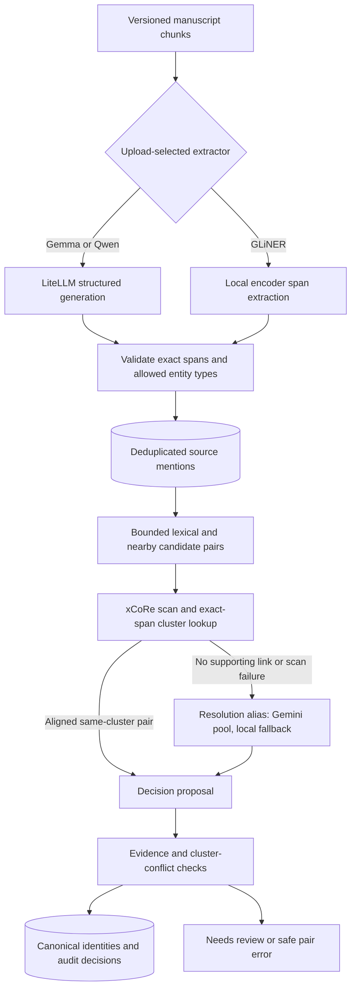

# Entity extraction and resolution

[Guide index](README.md) · Previous: [Search](embeddings-and-search.md) · Next: [Structured memory](structured-story-memory.md)

## Purpose

Extraction finds named occurrences and their types. Resolution decides which occurrences refer to the same identity. Similar spelling creates a candidate for comparison; it does not establish identity.

## Architecture

The proposal box also carries `keep_separate` and `needs_review` decisions from the LLM. The two extraction branches are explicit alternatives, not an automatic GLiNER-to-LLM cascade.

## Extraction: spans and type classification

The upload catalog currently exposes `gemma4-e4b` (default), `gliner2.5-base-v1`, and `qwen3.5-9b`. The choice is pinned on the manuscript version, so changing a later default does not reinterpret an already selected upload.

Both model families support six application categories: `character`, `facility`, `gpe`, `location`, `organization`, and `vehicle`. Buildings are facilities, settlements/countries are GPEs, and natural places are locations. General artifacts and a catch-all category are excluded.

- **Generative extraction:** Gemma/Qwen receive `entity_extractor:v3` and a strict JSON schema. They return surface text and entity type. Server logic expands each surface to its exact substring occurrences. A valid mixed result retains matching surfaces and records unmatched ones without forcing a repair; invalid schema or an all-invalid nonempty result gets one repair. Repeated failure fails extraction.
- **Specialist extraction:** GLiNER2.5 Base runs directly on CPU with six labels and threshold `0.5`. It returns spans/types; the server requires `text[start:end] == surface_text`. Malformed spans fail explicitly. There is no generative repair loop in this branch.

This is where entity type classification happens; no separate text-classification service exists. GLiNER is a pretrained encoder extractor, not a custom-trained StoryGuard model or a LiteLLM deployment. One inference lock serializes GLiNER calls per worker process.

Chunk-relative spans are converted to chapter-relative spans. Deduplication removes the same occurrence detected in overlapping chunks while preserving distinct occurrences. Validating a span proves the text exists at that position; it does not prove its type is correct. The generative path expands all exact substrings, so a predicted “Mara” can also match inside “Mara Vale.” Complete-name boundaries are requested in the prompt, not independently guaranteed by that substring matcher.

## Resolution: candidate, prediction, committed decision

1. **Prepare candidates.** Same-type mentions are compared through normalized name tokens and nearby context. Recent-token and nearby buffers are bounded; at most six previous mentions are considered per mention, with a 2,000-pair ceiling. Context radius is 500 characters. These limits can miss distant aliases.
2. **Try coreference support.** `sapienzanlp/xcore-litbank` predicts clusters over original chapter windows, with a default window of 800 tokens. The isolated Python runtime avoids dependency conflicts with the main application. Only exact aligned candidate spans within a supported cluster bypass the LLM. Cross-window clusters are not joined.
3. **Resolve remaining pairs.** The stable resolution alias now uses the Gemini pool with local Gemma fallback. The config name `coreference_gemma` and some counters retain historical Gemma naming; they do not mean the primary LLM is still local Gemma.
4. **Validate output.** Decisions are `merge`, `keep_separate`, or `needs_review`. Cited IDs must be supplied by the server; merge/separation must cover both mentions. Invalid output gets one repair.
5. **Apply safely.** Automatic application is enabled. The server checks canonical roots and existing keep-separate constraints before committing an identity change and its audit record together. Incompatible proposals remain for review.

## Worked example

Extraction can produce “Mara Vale,” “Mara,” “North Hall,” “Porto,” and “Ilya Reed” with types. “Mara” and “Mara Vale” are identity candidates. A supported coreference link or a valid model decision may merge them. “Ilya Reed” remains a separate character even though both people occur in the wedding sentence.

The relationship “Mara is married to Ilya” belongs to the next workflow. Entity resolution answers **who is who**, not **how two people are related**. All example decisions are illustrative.

## Persistence, Stop, and Resume

Each pair's prediction, evidence, model/deployment metadata, attempts, and applied decision are recorded. Canonical merge links and aliases retain source history; an audited merge is different from deleting original mentions. This does not imply a public undo endpoint.

Worker batches permit at most 20 LLM pair evaluations and a 300-second loop budget; unfinished bounded batches continue automatically. Per-call timeouts and the separate coreference scan limit also apply, so the loop budget is not a universal hard deadline for all work. Stop preserves committed decisions and cancels unfinished work; Resume can reuse completed coreference caches and saved predictions. Coreference failure or its 30-minute limit visibly falls back to the configured LLM path.

## Implementation links

[Model choices](../../backend/app/ai/extraction_models.py) · [LLM extractor](../../backend/app/ai/entity_extraction.py) · [GLiNER adapter](../../backend/app/ai/gliner_extraction.py) · [mention persistence](../../backend/app/entity_mentions.py) · [candidate/merge rules](../../backend/app/entity_resolution.py) · [coreference loader](../../backend/app/ai/coreference.py) · [isolated inference](../../backend/scripts/coreference_predict.py) · [resolution worker](../../backend/app/queue/tasks/entity_resolution.py) · [resolution tests](../../backend/tests/test_entity_resolution.py)

## Choices, failures, and limitations

A small specialist extractor offers much lower measured latency, but historically lower exact-span/type recall. That comparison used older labels; it is evidence for the trade-off, not a current six-category accuracy claim. [GLiNER experiment and follow-up](../experiments/2026-08-30-entity-extraction-gliner25-base.md)

Coreference is also fallible. An incorrect cluster can create an incorrect merge, and absence of a link does not establish separate identities. Candidate-generation misses cannot be fixed by upgrading the pair-comparison model. Full-book identity accuracy and speedup are not established by the small promotion fixtures. See [coreference promotion](../experiments/2026-08-31-coreference-gemma-promotion.md).
