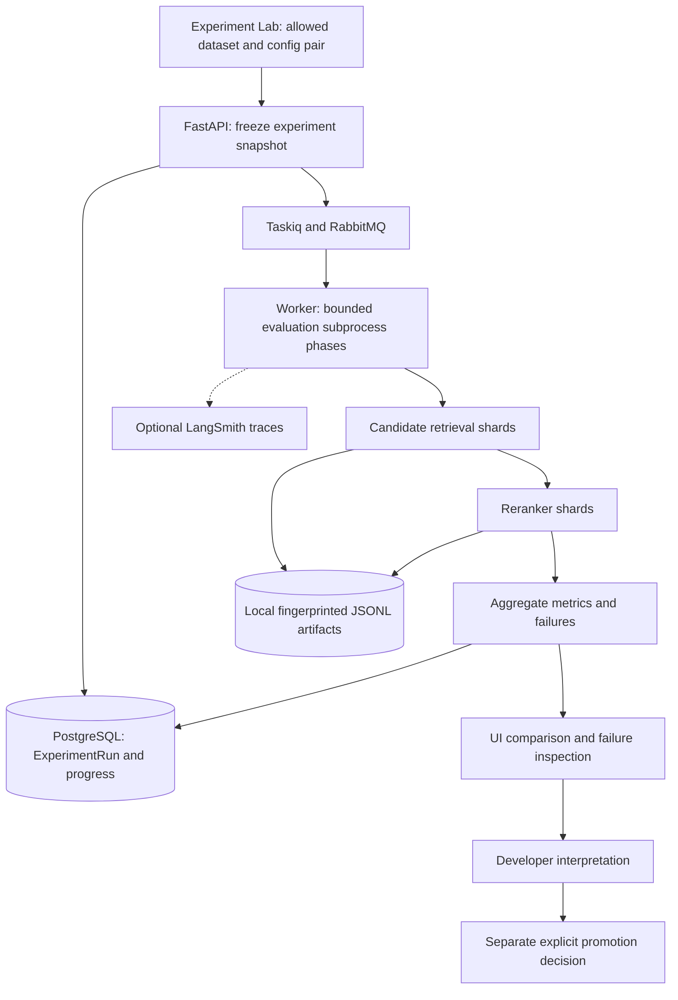

# Evaluation and observability

[Guide index](README.md) · Previous: [Models](models-and-gateway.md) · Next: [Interview guide](interview-guide.md)

## Purpose

Separate “the workflow ran” from “the model improved.” Deterministic tests check code invariants; integration tests check real connections; evaluations measure labeled behavior; traces explain a particular execution. None substitutes for the others.

## Experiment architecture

## Datasets and reproducibility

The [dataset registry](../../config/datasets.yaml), [manifest](../../data/datasets/manifest.json), and [dataset guide](../DATASETS.md) record provenance, immutable revisions, transformations, hashes, and usage terms. The project is personal/non-commercial. Preserve those source notices rather than assuming all manuscript benchmarks are unrestricted.

- Public-domain manuscript selections support ingestion and diagnostic work.
- The `feyninc/gacha` retrieval selection contains 292 queries over ten books: 59 development queries and 233 held-out test queries. Query relevance labels identify the source passages used for retrieval evaluation.
- NarrativeQA fixtures are preparation for future answer evaluation, not evidence that grounded QA is implemented.
- Versioned synthetic entity/resolution/memory fixtures isolate labeled behaviors and edge cases. Older fixture scores cannot be transferred to changed entity categories or prompts.

Many downloaded fixtures and detailed outputs are ignored by Git. A clean clone needs dataset bootstrap for the relevant experiments; see the existing [bootstrap script](../../backend/scripts/bootstrap_datasets.py). A local `.local/experiments/...` path in a report is not a public downloadable artifact.

The current UI Experiment Lab compares only `hybrid-rrf` with `hybrid-rrf-reranker`, using allowlisted development/smoke suites. Its catalog explicitly marks them `promotion_eligible=false`. Entity/model/memory experiments use separate existing CLI runners; the UI is not a general arbitrary-model experiment executor.

Fingerprinting separates reusable candidate retrieval from reranking results. Document/model/chunking changes invalidate the relevant artifacts. Aggregation can reuse completed shards without rerunning model inference. This is exact experiment reuse, not semantic caching of user answers.

## Metrics and how to interpret them

| Metric | Question answered | Common misinterpretation |
| --- | --- | --- |
| Recall@K | How much labeled relevant evidence appears in the first K results? | High retrieval recall does not prove a generated answer is supported |
| MRR@10 | How early does the first relevant result appear, up to rank ten? | It does not measure all relevant passages or answer correctness |
| Exact-span/type precision, recall, F1 | Did extraction recover the labeled occurrence and type? | Matching text alone does not imply the correct entity type |
| Model decision accuracy | Was the generated candidate-pair decision correct? | Excludes pairs candidate generation never found |
| End-to-end resolution accuracy | Did the full candidate/decision pipeline handle labeled cases? | Must count misses/failures, not only successful provider responses |
| First-pass valid output / repairs / provider errors | How reliably did the call produce usable structure? | Valid JSON is not semantic truth |
| Latency and token/cost records | What did this environment and run consume? | Local API charges of zero do not mean zero compute cost |

## Recorded results

These are **historical measurements, not evaluations rerun for this documentation update**.

| Comparison and scope | Recorded result | Meaning and source |
| --- | --- | --- |
| BM25 → Hybrid RRF; held-out retrieval split | Recall@10: 0.8734 → 0.9056; MRR@10: 0.6700 → 0.7126 | Better aggregate retrieval, with individual regressions. [RRF report](../experiments/2026-08-25-hybrid-rrf.md) |
| Hybrid → reranked hybrid; 233 test queries | MRR@10: 0.7126 → 0.8544; Recall@30 unchanged at 0.9764; median local latency 147 → 10,917 ms | Better ordering, large latency cost; cannot recover missing candidates. [Reranker record](../learning/cross-encoder-reranking.md) |
| Gemma V2 → GLiNER; 24 examples, 54 gold mentions, older labels | Exact F1: 0.9444 → 0.7568; steady p50 10,666.5 → 38.3 ms | Speed/quality trade-off; not a six-category current benchmark. [Extraction report](../experiments/2026-08-30-entity-extraction-gliner25-base.md) |
| Gemma → xCoRe + Gemma; five development cases | Accuracy 80% → 60%; calls 5 → 4; incorrect merges 1 → 2 | Speed-oriented promotion accepted known wrong-merge risk. [Coreference report](../experiments/2026-08-31-coreference-gemma-promotion.md) |
| Local Gemma → Gemini 3.5 Flash Lite; 19 cases, 18 comparisons | Model decisions 17/18 → 18/18; end-to-end 17/19 → 18/19; p50 20.56 → 0.84 s | One candidate-generation miss remained; small quality sample. [Gateway record](../learning/model-gateway-and-tradeoffs.md) |
| Gemini 3.5 vs 3.1 pool admission; same fixed 19 cases | Both 18/18 model decisions, 18/19 end-to-end, 100% first-pass output | 3.1 admitted; API Gemma rejected after 9/18 provider failures. [Pool report](../experiments/2026-09-13-flash-lite-pool-promotion.md) |
| Structured memory V7 vs historical V8; 12 cases | Semantic macro F1 0.715 vs 0.200; failures 1/12 vs 9/12 | Stricter verifier was not promoted. [Memory record](../learning/structured-story-memory.md) |

Do not compare latency across rows as though the models ran the same task on the same hardware. Historical dollar estimates retain their run's pricing assumptions; they are not current bills or universal prices.

## Worked example: diagnose before changing a model

For the teaching query “Where did Mara get married?”, first inspect whether the wedding chunk is in the fused top 30. If absent, investigate parsing, scope, lexical/vector retrieval, and relevance labels. If present but ranked poorly after reranking, inspect the cross-encoder. If search finds the passage but memory lacks the marriage, inspect extraction and validation instead. These are separate failure stages.

For an identity mistake, distinguish a missing candidate, an incorrect xCoRe shortcut, a wrong LLM decision, and a conflicting application decision. A successful HTTP response rules out none of those semantic failures.

## LangSmith traces

Tracing is optional and off by default. Configure `LANGSMITH_TRACING`, `LANGSMITH_API_KEY`, `LANGSMITH_ENDPOINT`, `LANGSMITH_PROJECT`, and `LANGSMITH_TRACE_CONTENT` using the [environment template](../../.env.example); never commit real credentials.

| Content mode | Intended exported content |
| --- | --- |
| `minimal` (default) | Counts, timings, scores, versions, safe codes; retrieval scope IDs hashed; no raw query/manuscript text |
| `redacted` | Diagnostic metadata plus placeholders for supported text-shaped fields |
| `full` | Raw text on instrumented paths; explicit opt-in for suitable public/synthetic inputs |

Each workflow defines its own trace field allowlist; do not assume all IDs in all traces are hashed. Resolution batch/cache diagnostics remain metadata-only. A trace ID generated locally does not prove export succeeded; historical delivery checks are described in their source reports.

Search traces include `retrieve_hybrid` or `retrieve_hybrid_reranked`, parallel BM25/vector children, `rrf_fusion`, and optionally `reranker`. Resolution batches correlate job/batch IDs with coreference and model calls. Gateway fields include actual deployment ID, safe retry/fallback counters, timing, and usage when available. Cumulative committed totals must not be summed across batches; predictions and applied merges are different counts.

Tracing is not limited to LLM calls: retrieval and deterministic stages are instrumented now. Older pre-Lesson-4.1 reports with no trace IDs describe their historical state. Trace export/annotation failures are intended not to block domain work.

## Implementation links and checks

[Experiment API](../../backend/app/api/experiments.py) · [suite/config allowlist](../../backend/app/ai/experiment_suites.py) · [snapshot construction](../../backend/app/ai/experiments.py) · [experiment worker](../../backend/app/queue/tasks/experiments.py) · [retrieval evaluator](../../backend/scripts/bm25_experiment.py) · [trace sanitization](../../backend/app/ai/tracing.py) · [tests](../../backend/tests) · [real ingestion browser check](../../frontend/e2e/real-ingestion.spec.ts)

Tests with fake model responses verify control flow and validation; they do not establish model accuracy. Browser tests intercepting routes verify UI contracts; real-flow tests must reach the application API/storage/worker without those intercepts. No existing test/eval result is relabeled as a new run here.

## Limitations

The fixtures are small in several domains and do not establish book-scale quality. Development suites are for iteration, not final promotion claims. Promotion remains an explicit developer decision after interpreting baseline/candidate results; the app does not automatically select a winner or rewrite model configuration.
