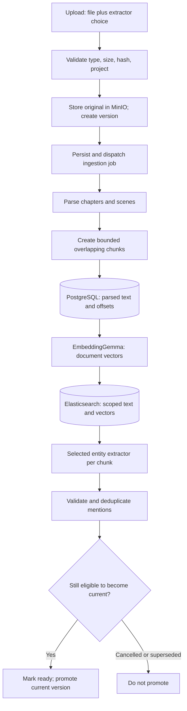

# Manuscript ingestion

[Guide index](README.md) · Previous: [Application and storage](application-and-storage.md) · Next: [Search](embeddings-and-search.md)

## Purpose

Turn an uploaded document into versioned, source-aligned text that can be searched and interpreted. Parsing and chunking are deterministic Python logic, not LLM calls.

## Pipeline

## Low-level steps

1. **Accept a source.** Supported extensions/MIME pairs are TXT, Markdown, and DOCX. The server strips filename paths, rejects empty uploads, applies a default 50 MiB limit, and computes SHA-256. The extractor is selected from a server-owned enum and stored on the version.
2. **Create a version.** A project row lock serializes version numbering. The object key is `projects/{project_id}/manuscripts/{version_id}/original{suffix}`. MinIO retains the bytes; PostgreSQL stores metadata and the content hash. Identical bytes do not imply automatic upload deduplication.
3. **Dispatch.** A persisted `JobRun` passes through an `awaiting_dispatch` stage. Queue failure records `QUEUE_UNAVAILABLE`; an unaccepted upload must not supersede accepted work.
4. **Parse.** The worker downloads the file, produces chapters/scenes/chunks, and stores them in PostgreSQL. TXT/Markdown must be UTF-8; DOCX uses `python-docx` with archive entry-count and expanded-size checks. DOCX headings/tables and text markers are handled explicitly.
5. **Embed and index.** Document vectors are computed in batches of eight. The index replacement deletes/reinserts only the requested project/version, checks embedding shape/version, and uses Elasticsearch bulk writes. PostgreSQL chunks record the embedding version after successful indexing.
6. **Extract mentions.** The version's selected extractor runs on each chunk. Exact source spans are validated and overlap duplicates are collapsed before persistence.
7. **Promote.** Only after all required stages succeed does the version become `ready` and the project pointer advance. A cancelled or superseded job must not replace a newer accepted version.

## Parsing and offsets

The parser recognizes Markdown headings, DOCX heading styles, and conservative text chapter/scene markers. Sequence heuristics and duplicate-heading handling reduce table-of-contents mistakes. Without reliable chapter structure, it uses one chapter and records a warning.

Current settings are **target 700, maximum 900, overlap 100 tokens**, version `storyguard-700-900-v1`. These are regex tokens (`words or punctuation`), not a model tokenizer's tokens. Chunks prefer sentence/paragraph boundaries near the target, fall back to the maximum, and stay inside a scene. Short scenes need not reach 700 tokens.

Offsets are half-open Python character positions in **parsed chapter text**: `chapter.text[start_offset:end_offset]`. They are not byte offsets, DOCX page coordinates, or positions in the original file. Parsing normalizes line endings and joins blocks; preserving the original file and the parsed-text hash makes this distinction inspectable.

## Worked example

The teaching manuscript's two Markdown headings produce two chapters. Each short chapter has one scene/chunk. In Chapter 1, `Mara Vale` occupies `[0:9]`; the second sentence's `Mara` occupies `[28:32]`. The title is stored separately from chapter body text.

For a larger scene, adjacent chunks overlap by up to the configured token overlap. Two detections of the same source occurrence are deduplicated by source identity/span; repeated “Mara” at different offsets remains separate mentions.

## Implementation links

[Upload and object storage](../../backend/app/manuscripts.py) · [dispatch/cancellation routes](../../backend/app/api/ingestion.py) · [parser](../../backend/app/parsing.py) · [ingestion worker](../../backend/app/queue/tasks/ingestion.py) · [mention orchestration](../../backend/app/entity_mentions.py) · [parser tests](../../backend/tests/test_parsing.py) · [upload/lifecycle tests](../../backend/tests/test_application_api.py)

## Choices, failures, and limitations

Overlap helps preserve boundary context but increases embedding/extraction work and creates duplicates that must be collapsed. Structural boundaries keep chunks readable, but deterministic heading rules can still misread unconventional manuscripts.

Stage-specific errors distinguish parsing, embedding, indexing, and extraction failure. Cancellation is cooperative: an in-flight inference can finish, but its result must not promote a cancelled version. Partial derived data can remain after failure; the current-version pointer is the visibility gate, not a cross-store rollback.

An extraction failure prevents ingestion promotion even if indexing succeeded. New uploads can supersede older in-progress work while the last ready version remains readable. Index replacement and retry are not transactional across PostgreSQL and Elasticsearch; recovery should use persisted job state rather than assuming exactly-once execution.
