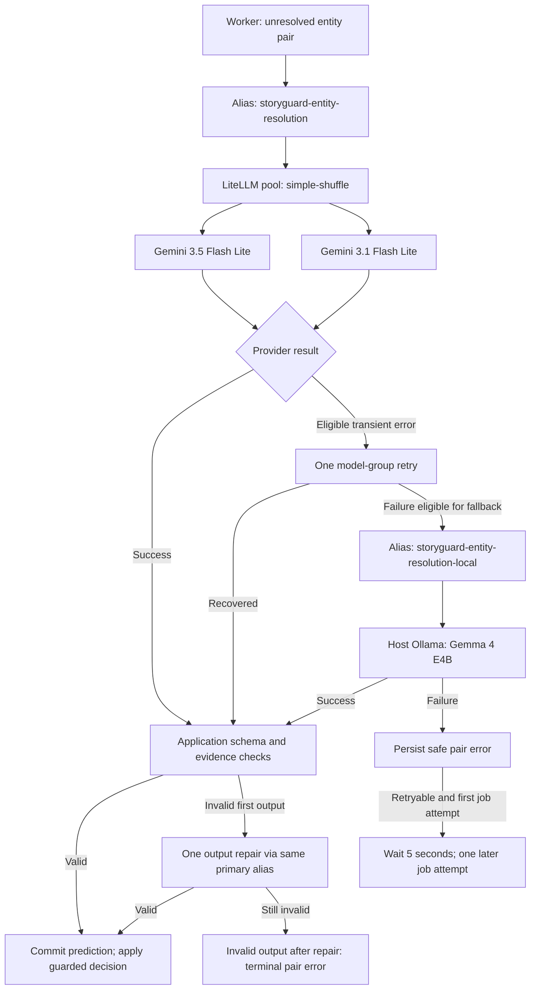

# Models and LiteLLM

[Guide index](README.md) · Previous: [Structured memory](structured-story-memory.md) · Next: [Evaluation](evaluation-and-observability.md)

## Purpose

Use pretrained models for specific tasks and keep provider routing outside domain logic. StoryGuard's custom work is orchestration, prompts, validation, evidence handling, persistence, and evaluation. It has not trained the listed models or deployed a fine-tuned adapter.

## Model inventory

| Task | Current model | Execution path | Status |
| --- | --- | --- | --- |
| Document/query embeddings | `google/embeddinggemma-300m` | Sentence Transformers in worker/API; 768 dimensions | Active |
| Query/passage reranking | `BAAI/bge-reranker-v2-m3` | Local CrossEncoder in API | Available; current search default is on |
| Named mention/type extraction | `gemma4:e4b` | LiteLLM → host Ollama | Default upload choice |
| Faster mention/type extraction | `fastino/gliner2.5-base-v1` | GLiNER2 directly in worker, CPU, threshold 0.5 | Explicit upload alternative |
| Alternative generative extraction | `qwen3.5:9b` | LiteLLM → host Ollama | Explicit upload alternative |
| Coreference | `sapienzanlp/xcore-litbank`, encoder `microsoft/deberta-v3-large` | Isolated Python 3.11 subprocess inside worker | Active exact-span shortcut |
| Remaining identity comparisons | `gemini/gemini-3.5-flash-lite` and `gemini/gemini-3.1-flash-lite` | LiteLLM deployment pool → Google API | Promoted pool |
| Resolution provider fallback | `gemma4:e4b` | Separate LiteLLM alias → host Ollama | Active bounded fallback |
| Facts/events/relationships | `gemma4:e4b`, prompt V7 | `storyguard-fast` → LiteLLM → Ollama | Active |
| Smaller Qwen comparison | `qwen3.5:4b` | Configured LiteLLM alias | Experiment/config option; not in upload catalog |

Hugging Face models have pinned repository revisions. Ollama digests are recorded in model metadata, but calls use model tags; metadata alone does not force the running Ollama tag to remain immutable. Record/verify actual deployed identity when reproducing results. See [model registry](../../config/models.yaml), [coreference pins](../../backend/scripts/coreference_predict.py), and [gateway deployments](../../config/litellm.yaml).

## Resolution routing

[Shareable SVG](diagrams/models-and-gateway.svg). This depicts the promoted transient-failure path. Authentication, bad-request, and content-policy errors have zero configured provider retries; do not interpret the diagram as a retry guarantee for every exception. Request deadlines can also stop a call before the complete gateway sequence finishes.

## Alias, pool, deployment, provider

The application sends an OpenAI-compatible `/v1/chat/completions` request to LiteLLM with a **semantic alias**, messages, temperature `0`, and a strict JSON schema derived from Pydantic. The server owns the model catalog; callers cannot supply arbitrary provider IDs or URLs.

Both API deployments share `model_name: storyguard-entity-resolution`. Their distinct IDs are `sg-resolution-prod-gemini35-lite-v1` and `sg-resolution-prod-gemini31-lite-v1`. No routing strategy or weighting is set explicitly; LiteLLM's default is **simple-shuffle**, distributing requests across eligible deployments. This is not round-robin, a content classifier, or a guarantee of a 50/50 split in a short run. [LiteLLM router configuration](https://docs.litellm.ai/docs/proxy/configs)

The registry's `default: gemini35-lite` selects application metadata and the shared alias. Because the alias is a pool, an actual response may come from 3.1 instead. The application maps the returned `x-litellm-model-id` through server-owned deployment metadata for audit and traces. Knowing the requested alias is insufficient to know which model served the request.

Extraction uses its own Gemma/Qwen aliases. Structured memory uses `storyguard-fast`. Those aliases do **not** inherit the resolution pool or its explicit local fallback merely because they also pass through LiteLLM.

## Three different recovery mechanisms

| Mechanism | Trigger | Current resolution behavior |
| --- | --- | --- |
| Gateway provider retry/fallback | Timeout, rate limit, server/transport availability failure as classified by gateway | Transient model-group retry budget of one; one configured fallback group, local Gemma; local group has zero provider retries |
| Application output repair | Returned content fails schema/evidence checks | One repair through the same application alias; second invalid result is terminal |
| Later worker pair attempt | Persisted retryable provider error | At most one additional job attempt, delayed five seconds; saved attempt count bounds repeats |

The resolution output cap is 1,536 tokens; configured request allowance is 180 seconds for each application completion, including a repair. Multiple layers mean “one retry” is not a complete description of total possible calls. The worker's cancellation/deadline checks and gateway telemetry are needed to interpret actual attempts.

An output repair can land on the other Flash Lite deployment because it reuses the pool alias. It is still a repair, not evidence that provider fallback occurred. Invalid structured output does not itself activate the provider fallback policy.

## Worked example

Suppose xCoRe does not link the teaching example's “Mara” and “Mara Vale.” The worker supplies both mentions and server-issued excerpts to the resolution alias. LiteLLM selects an eligible Gemini deployment. A valid decision citing both mentions can be persisted and applied after conflict checks.

If the provider rate-limits the request, the gateway may retry another healthy deployment, then use local Gemma if eligible and time remains. If the provider instead returns JSON citing a made-up evidence ID, the application requests repair. These are hypothetical paths, not new live model runs.

## Implementation links

[Gateway config](../../config/litellm.yaml) · [server-owned model selection](../../backend/app/ai/extraction_models.py) · [shared HTTP/schema client](../../backend/app/ai/entity_extraction.py) · [pair comparison and deployment mapping](../../backend/app/ai/entity_resolution.py) · [durable pair retry rules](../../backend/app/entity_resolution.py) · [worker continuation](../../backend/app/queue/tasks/entity_resolution.py) · [gateway contracts](../../backend/tests/test_model_gateway.py)

## Choices, failures, and limitations

The two API deployments were independently evaluated before admission. A historical four-call routing smoke reached both IDs, proving reachability, not statistical fairness. Multiple keys/projects are not provisioned by this setup; no quota-management service or Redis router state is configured. [Pool promotion report](../experiments/2026-09-13-flash-lite-pool-promotion.md)

Local fallback reduces reliance on API availability but can be slow or unavailable itself. The five-second retry sleep occupies a worker slot and is not a durable timer; a crash can require Resume. API-routed resolution sends its supplied source excerpts externally even when trace content mode is minimal. Trace privacy settings control telemetry, not model-provider inputs.

Model quality, availability, latency, and price must be assessed separately. The recorded rejection of API Gemma 4 31B followed frequent provider failures; provider family alone did not predict operational suitability. Historical cost estimates are dated evidence, not current provider-price quotes.
