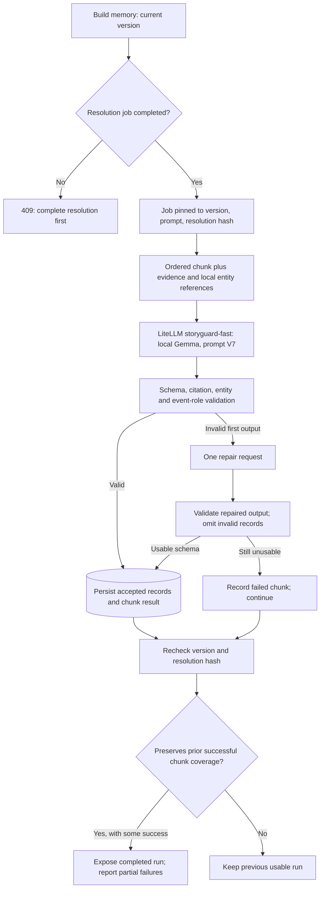

# Structured story memory

[Guide index](README.md) · Previous: [Entities](entity-extraction-and-resolution.md) · Next: [Models and gateway](models-and-gateway.md)

## Purpose

Store source-linked facts, events, and relationships that readers can inspect in Story Bible and Timeline. This workflow uses a prompted general-purpose model plus deterministic validation. There is no separate relationship-classification model or graph database.

## Architecture

Scope is checked at job start, during persistence, and before completion; the diagram compresses those repeated checks.

## Inputs and records

`POST /api/projects/{project_id}/structured-memory/run` accepts a manuscript version and optional `rebuild`. The API requires the current ready version and a completed resolution job. It reuses active work or eligible completed work instead of blindly creating duplicate jobs.

Each chunk supplies one server-issued evidence block and references for resolved entities assigned to that chunk. The evidence contains text plus chapter-relative offsets; its deterministic ID derives from source identity and content. The model receives these IDs, not permission to invent new evidence.

| Record | Meaning | Important fields |
| --- | --- | --- |
| Fact | An attributed statement such as an appearance or affiliation | Subject, predicate, object, type, optional resolved entity links, evidence |
| Event | Something that happens | Type, description, participants, locations, narrative position, raw/normalized story time, evidence |
| Relationship | A typed connection between resolved entities | Source/target IDs, relation type, status, optional start/end events, evidence |
| Chunk result | Processing/accounting result | Success/failure, accepted/rejected counts, repair count, prompt/model provenance, latency, tokens |

Facts can have literal values; relationships require resolved endpoints. Narrative position and chronological story time are stored separately. A flashback encountered in Chapter 10 can describe an event earlier than one encountered in Chapter 1.

## Worked example

For the [teaching manuscript](README.md#one-example-throughout), an illustrative extraction is:

| Source | Potential structured record |
| --- | --- |
| “Mara Vale wore a blue coat.” | Fact: subject Mara Vale, predicate `coat_color`, value `blue`, type `attribute` |
| “On June 1, 2023, Mara Vale and Ilya Reed married in Porto.” | `relationship_started` event with both people and Porto; `spouse_of` relationship linked to that event |
| “On March 2, 2024, Mara Vale and Ilya Reed divorced in Porto.” | `relationship_ended` event; matching relationship updated with end event and `ended` status |

The events remain queryable after the relationship ends. A model must actually return the required roles and compatible citations for this to pass validation. This example is a conceptual result, not a captured response.

## Validation and repair

The active version is `structured_memory:candidate_v7`, using `storyguard-fast` → local `gemma4:e4b`, a 4,096 output-token cap, and a 180-second request timeout. V7 shares prompt text with an earlier candidate; its behavior also depends on validator settings. A prompt version is more than the visible prose alone.

Validation checks the schema and controlled taxonomies, allowed citation IDs, entity/text agreement, location types, and relationship endpoints. V7 resolves unambiguous names from supplied entity references, canonicalizes movement/accident roles, and requires at least two supported participants for communication events. A relationship start/end must reference an accepted matching event with both endpoints and shared evidence. Symmetric relationships get canonical endpoint ordering.

A first response with rejected records triggers one repair. On the repaired response, valid records may be retained while invalid records are omitted and counted. A response that still cannot be parsed/validated as a usable schema fails that chunk; recognized model errors are recorded and other chunks continue. This distinction matters: “one invalid record” does not always mean “discard the whole repaired chunk.”

These checks establish structural and referential consistency. They do not prove that a fact is entailed by the passage, or that dates and events were interpreted correctly. No general semantic verifier is currently promoted for this workflow.

## Persistence and usable-run selection

The resolution fingerprint includes entities, merge state, aliases, mention assignments, text, and spans. A changed version or fingerprint fences the worker and hides incompatible old runs from current reads.

Persistence deduplicates records using normalized keys and updates event-backed relationship state. This collapses overlap duplicates, but it is not semantic event resolution: repeated events with indistinguishable key fields can also collapse. Before accepting a rebuild, the worker checks that its successful chunk set contains all previously successful chunks from the best prior compatible run. Equal counts with different missing chunks are not sufficient. All chunks failing or losing prior coverage leaves the attempt failed; a partial usable run reports omitted chunks. Read APIs choose a compatible completed run by successful coverage, then recency.

Coverage is processing coverage, not extraction recall. A chunk that produced no records may still count as processed. Missing memory is never evidence that the manuscript lacks a fact.

## Implementation links

[API and run selection](../../backend/app/api/structured_memory.py) · [worker lifecycle](../../backend/app/queue/tasks/structured_memory.py) · [prompts and validators](../../backend/app/ai/structured_memory.py) · [fingerprinting/persistence](../../backend/app/structured_memory.py) · [database schema](../../backend/app/db/models/structured_memory.py) · [workflow tests](../../backend/tests/test_structured_memory_workflow.py) · [Story Bible and Timeline](../../frontend/components/core-screens.tsx)

## Choices, failures, and limitations

PostgreSQL associations provide inspectable relationships without a separate graph service. Chunk-by-chunk extraction bounds each model request but loses cross-chunk context and inherits mention/resolution mistakes. Strict role checks can lower relationship recall while protecting consistency.

The recorded V7 experiment had semantic macro F1 **0.715**, with **1/12 failed cases**. The historical V8 verifier regressed to **0.200**, with **9/12 failures**, and was not promoted. These small evaluations motivate the current choice; they do not establish full-manuscript accuracy. [Recorded evaluation and checkpoint](../learning/structured-story-memory.md)
