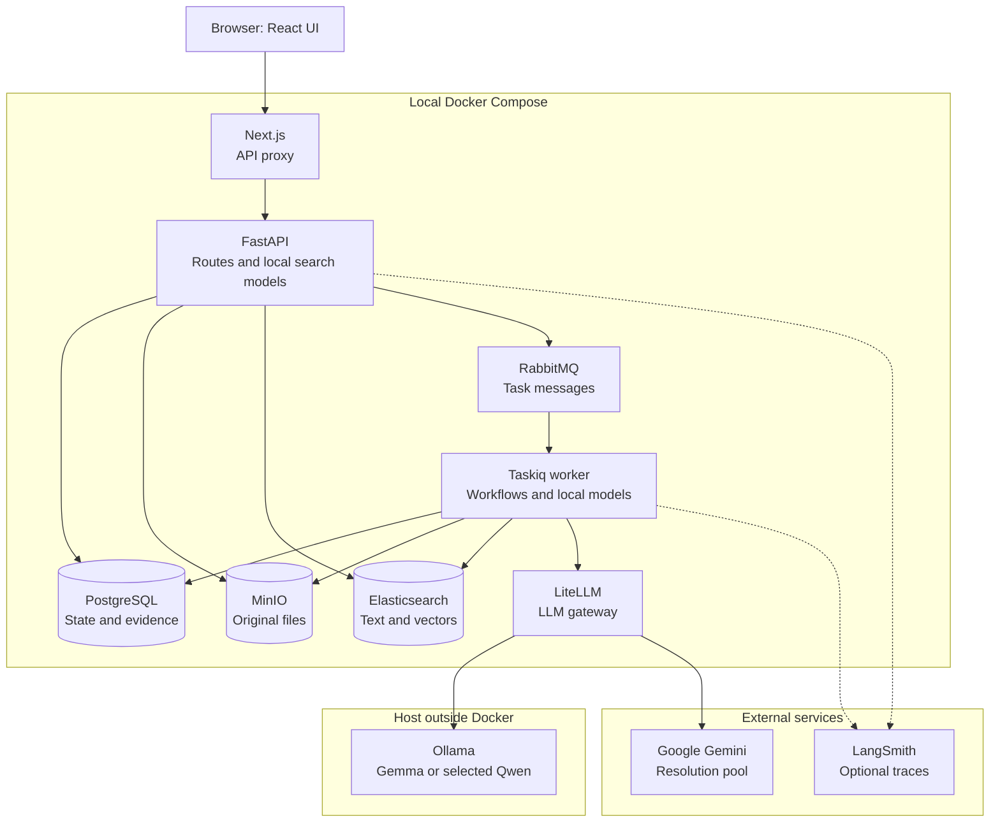

# System overview

[Guide index](README.md) · Next: [Application and storage](application-and-storage.md)

## Purpose

StoryGuard is a local AI engineering portfolio application for understanding manuscripts through searchable evidence and a structured Story Bible. The intended complete flow adds grounded questions and character-attribute continuity review. Today, ingestion, search, entity workflows, structured memory, and retrieval experiments are implemented.

The central design is to retain source text and evidence alongside model-produced records. PostgreSQL owns application state, MinIO retains uploaded files, and Elasticsearch holds a derived search index. Models propose interpretations; application code enforces scope, validates outputs, and records decisions.

## Architecture

Solid arrows show requests or data access. Dashed arrows show optional telemetry. Model downloads are omitted for readability.

[Shareable SVG](diagrams/system-overview.svg). The API runs EmbeddingGemma query encoding and BGE reranking; the worker runs document embeddings and selected GLiNER extraction. xCoRe uses an isolated Python environment inside the worker image. These are local execution paths, not additional network services. Local model files are downloaded and cached; inference does not route through LiteLLM for embeddings, reranking, GLiNER, or xCoRe.

## Capability status

| Capability | Current state |
| --- | --- |
| Project CRUD, TXT/Markdown/DOCX upload, manuscript versions, chapter reader | Implemented |
| Background ingestion, persisted progress, cancellation and supersession | Implemented |
| BM25 + vector retrieval + RRF; cross-encoder search option | Implemented; current search UI and API enable reranking by default |
| Entity extraction, canonical identities, resolution review and Stop/Resume | Implemented; automatic application of supported decisions enabled |
| Facts, events, relationships, Timeline, source evidence | Implemented; explicit memory build after completed resolution |
| Retrieval Experiment Lab and LangSmith instrumentation | Implemented; trace export disabled by default |
| Grounded Story QA, bounded LangGraph planning, answer verification/abstention | Upcoming course work; retrieval alone is not a completed QA system |
| Continuity findings and general version comparison | UI surfaces exist; corresponding analysis capabilities remain future work |
| SSE chat | Frontend reader exists; backend chat stream is not registered |
| LoRA training | Requested isolated post-core experiment; not implemented or automatically promoted |
| Cloud deployment | Outside current course; Docker Compose is local deployment |

## Worked example

With the [teaching manuscript](README.md#one-example-throughout), uploading creates a new version and a background ingestion job. Once successful, the reader and search use that version. “Resolve entities” can connect “Mara” to “Mara Vale”; “Build story memory” can then extract a marriage and divorce supported by passages. These interpretations are illustrative, not guaranteed outputs.

Search currently returns passages. A visible Ask screen does not imply that the backend can already generate a grounded answer.

## Technology choices

| Technology | Job in this repository | Why this boundary helps |
| --- | --- | --- |
| Next.js 16 / React 19 / TypeScript / Tailwind 4 | UI and same-origin API proxy | Browser interaction is separate from model/provider access |
| TanStack Query; Zod; React Hook Form | Server-state queries, selected response/form validation | UI reads real API state and handles explicit errors |
| FastAPI / Pydantic | HTTP contracts and validation | Structured inputs and outputs at request boundaries |
| SQLAlchemy 2 / Alembic / asyncpg / PostgreSQL 18 | Durable records and schema migrations | Transactions protect workflow and version state |
| MinIO | Original manuscript objects | Binary files stay outside relational rows |
| Elasticsearch 8.19 | BM25 and dense-vector retrieval | One derived index supports both search branches |
| Taskiq / RabbitMQ | Long-running work outside HTTP requests | Uploads can return a job ID before inference completes |
| Sentence Transformers / Torch / GLiNER2 / xCoRe | Local specialist inference | Use task-specific pretrained models where implemented |
| HTTPX / LiteLLM / Ollama | Structured LLM calls and deployment routing | Application aliases separate business code from providers |
| LangSmith | Optional execution traces | Inspect stage latency, routing, and failures |

Exact dependency pins live in the manifests; the table is a role map, not a compatibility promise. LangGraph is part of the target architecture but is not currently an installed backend dependency or active workflow engine.

## Implementation links

[Compose services](../../compose.yaml) · [registered API routes](../../backend/app/main.py) · [backend dependencies](../../backend/requirements.txt) · [frontend dependencies](../../frontend/package.json) · [model configuration](../../config/models.yaml) · [current course state](../../COURSE_PROGRESS.md)

## Choices, failures, and limitations

This is a personal non-commercial local application. Project/version filtering prevents mixing manuscript data; it does not establish user authentication or tenant authorization. There is no demonstrated cloud/high-availability deployment.

Derived search and extracted memory can fail independently. A record with a valid citation can still misinterpret the cited text. Missing extracted records never prove that an event or fact is absent from the manuscript. These limits are part of the architecture explanation, not hidden behind an “AI accuracy” claim.
